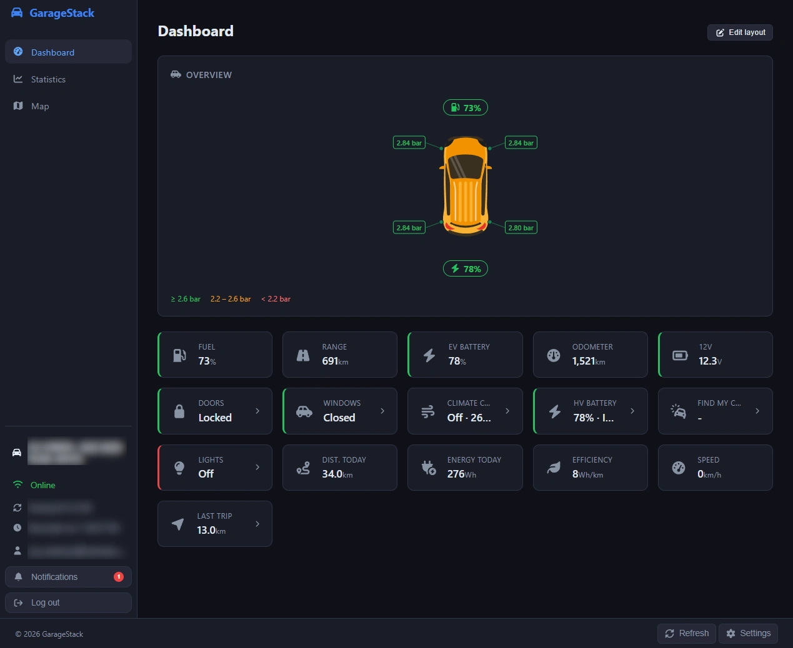
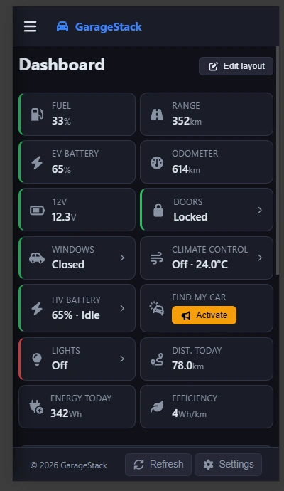

# GarageStack

GarageStack is a free, open-source vehicle monitoring dashboard for MG / SAIC cars. It connects to the SAIC iSmart API (the same backend as the official MG iSmart app) and presents your car's live telemetry in a clean, self-hosted web app. The project is designed to work across HEV, PHEV, and BEV variants of the MG lineup - cards that are not relevant to your vehicle type are automatically hidden or adapted.

Features include a live dashboard, trip history with map and heatmap visualisation, energy statistics, and remote commands (climate, lock/unlock, find-my-car). The app is a PWA, so it can be installed on your phone or desktop and receives push notifications.

### Dashboard cards

Cards are shown or hidden automatically based on vehicle type (HEV / PHEV / BEV). You can also reorder and toggle individual cards in the dashboard's edit mode.

| Card | Description | Vehicle types |
|------|-------------|---------------|
| Fuel Level | Tank level as a percentage | HEV, PHEV |
| Fuel Range | Estimated remaining range | HEV, PHEV |
| EV Battery | State of charge (%) | All |
| Charging | Charging indicator | PHEV, BEV |
| Odometer | Total distance driven | All |
| 12V Battery | Auxiliary battery voltage | All |
| Doors | Lock status and door states | All |
| Windows | Window and sunroof states | All |
| Sunroof | Sunroof open/closed | All (off by default) |
| Climate | Temperature, seat heating, defroster | All |
| HV Battery | kWh, voltage, current, power | All |
| Find My Car | Horn + lights to locate the car | All |
| Lights | Main beam, low beam, sidelights | All |
| Daily Distance | Distance driven today | All |
| Daily Energy | Energy used today (Wh) | All |
| Since Charge | Distance since last charge session | PHEV, BEV |
| Efficiency | Energy per km (Wh/km) | All |
| Speed | Current vehicle speed | All |
| Active Trip | Distance covered in the current trip | All |
| Online Status | Whether the car is reachable via SAIC cloud | All |
| Charge Time | Estimated minutes remaining to charge limit | PHEV, BEV |
| Charging Session | OBC power, cable lock, charging type | PHEV, BEV |
| Battery Heating | Pre-heating status and schedule | PHEV, BEV |

## Screenshots

| Desktop | Mobile |
|---------|--------|
|  |  |

---

## MG iSmart account and session limits

> **Important:** The MG iSmart API only allows one active session per account at a time. Logging in anywhere else with the same credentials -- including the official MG app -- will immediately invalidate GarageStack's session, causing telemetry to stop until GarageStack reconnects.

To use GarageStack alongside the official MG app without interrupting either, set up a secondary account:

1. Open the MG app and go to **Settings > Account management > Add secondary account** (exact wording varies by region and app version).
2. Invite a second email address and accept the invite on that account.
3. Grant the secondary account access to your vehicle.
4. Use the secondary account's credentials for `SAIC_USER` / `SAIC_PASSWORD` in GarageStack.

This way the official app keeps its own session on the owner account and GarageStack runs independently on the secondary account.

---

## Installation

Choose the method that fits your environment.

---

### Option A: All-in-one container (Unraid / homelab)

A single Docker image that bundles every service -- nginx, the .NET API + worker, PostgreSQL, Mosquitto, and the SAIC gateway. No Compose file or external database needed. Ideal for Unraid and similar NAS environments where running multiple containers is inconvenient.

**Quick start**

```bash
docker run -d \
  --name garagestack \
  -p 8080:80 \
  -v ./garagestack-data:/data \
  -e SAIC_USER=your@email.com \
  -e SAIC_PASSWORD=yourpassword \
  -e SAIC_REGION=eu \
  -e POSTGRES_PASSWORD=changeme \
  -e JWT_SECRET="$(openssl rand -base64 32)" \
  -e CORS_ORIGIN=http://192.168.1.100:8080 \
  ghcr.io/joszz/garagestack:latest
```

**Unraid:** import `unraid/garagestack.xml` from Community Apps and fill in the variables in the template UI.

See [`docker/all-in-one/README.md`](docker/all-in-one/README.md) for the full variable reference, volume layout, and Unraid setup steps.

---

### Option B: Docker Compose

Separate containers for each service. More flexible -- you can swap in your own PostgreSQL or MQTT broker, and containers update independently.

**1. Clone the repository**

```bash
git clone https://github.com/joszz/garagestack.git
cd garagestack
```

**2. Create your `.env` file**

```bash
cp .env.example .env
```

Then open `.env` and fill in at minimum:

| Variable | Description |
|----------|-------------|
| `SAIC_USER` | MG iSmart account email |
| `SAIC_PASSWORD` | MG iSmart account password |
| `SAIC_REGION` | `eu`, `cn`, or `row` |
| `POSTGRES_PASSWORD` | Pick a strong random password |
| `JWT_SECRET` | At least 32 random characters -- generate with `openssl rand -base64 32` |
| `CORS_ORIGIN` | The URL you open in your browser, e.g. `http://192.168.1.100:8080` |

`VAPID_PUBLIC_KEY` / `VAPID_PRIVATE_KEY` are optional; leave them empty to disable push notifications.

**3. Start the stack**

With the bundled PostgreSQL container:

```bash
docker compose --profile bundled-postgres up -d
```

Using your own existing PostgreSQL server (set `POSTGRES_HOST`, `POSTGRES_PORT`, `POSTGRES_USER`, `POSTGRES_DB`, `POSTGRES_PASSWORD` in `.env` to match):

```bash
docker compose up -d
```

The frontend is served on port `8080` by default (configurable via `FRONTEND_PORT` in `.env`).

---

## Push notifications

GarageStack checks your vehicle's state every 5 minutes and sends both a browser push notification and an in-app notification (bell icon) when any of the following conditions are detected. Each alert has a 1-hour cooldown per vehicle to avoid repeated notifications.

| Alert | Condition |
|-------|-----------|
| Engine started | Engine transitions from off to running |
| Low tyre pressure | Any tyre below 2.2 bar |
| Low EV battery | EV state-of-charge below 20 % |
| Car left unlocked | `doors/locked = false` while engine is off |
| Door left open | Any door, boot, or bonnet open while engine is off |
| Window left open | Any window or sunroof open while engine is off |

Push notifications require VAPID keys to be configured (`VAPID_PUBLIC_KEY` / `VAPID_PRIVATE_KEY`). Without them, alerts still appear in the in-app notification panel. The "engine started" alert is also triggered in real time when the event arrives over MQTT, independently of the 5-minute polling cycle.

Note: "keys left in the car" is not currently supported because the SAIC MQTT gateway does not expose a key-in-vehicle sensor.

---

## Homepage dashboard widget

GarageStack exposes a dedicated read-only endpoint for the [gethomepage.dev](https://gethomepage.dev) [Custom API widget](https://gethomepage.dev/widgets/services/customapi/). No fork or custom widget code is required.

### 1. Generate an API key

```bash
openssl rand -base64 32
```

Set `WIDGET_API_KEY` to the generated value in your `.env` file (Docker Compose) or as a container environment variable (all-in-one / Unraid). Leave it empty to keep the endpoint disabled.

### 2. Find your VIN

Log in to GarageStack and open the browser developer tools. The VIN appears in the `/api/vehicles` response, or in the URL when you navigate to your vehicle.

### 3. Configure Homepage

Add the following block to your Homepage `services.yaml`, replacing `YOUR_GARAGESTACK_URL`, `YOUR_VIN`, and `YOUR_WIDGET_API_KEY`:

```yaml
- GarageStack:
    href: https://YOUR_GARAGESTACK_URL
    description: MG Vehicle Status
    widget:
      type: customapi
      url: https://YOUR_GARAGESTACK_URL/api/widget/YOUR_VIN/status
      headers:
        X-Widget-Key: "YOUR_WIDGET_API_KEY"
      mappings:
        - field: evSocPercent
          label: Battery
          format: percent
        - field: isCharging
          label: Charging
          format: text
        - field: exteriorTemperature
          label: Ext. Temp
          format: float
          suffix: "°C"
        - field: isLocked
          label: Locked
          format: text
```

### Available fields

The endpoint returns a flat JSON object. Numeric fields are `null` when the vehicle has not reported that value yet. String state fields are also `null` when unreported, except `anyDoorOpen` and `anyWindowOpen` which are always present. String values are localized: the language is resolved from the request in this order: query string, cookie, `Accept-Language` header, falling back to `en`. Supported languages are `en` and `nl`. To pin a language regardless of the Homepage container's locale, append `?culture=nl&ui-culture=nl` (or `en`) to the widget URL.

| Field | Type | Description |
|-------|------|-------------|
| `recordedAt` | string (ISO 8601) | Timestamp of the most recent telemetry |
| `fuelLevelPercent` | number | Fuel tank level (%) |
| `fuelRangeKm` | number | Estimated fuel range (km) |
| `evSocPercent` | number | EV / HV battery state of charge (%) |
| `isCharging` | string | Charging state: `"Charging"` or `"Not charging"` |
| `chargerConnected` | string | Charger connection state: `"Plugged in"` or `"Unplugged"` |
| `mileageSinceLastCharge` | number | Distance driven since last full charge (km) |
| `hvSocKwh` | number | HV battery energy (kWh) |
| `hvTotalCapacityKwh` | number | HV battery total capacity (kWh) |
| `hvVoltage` | number | HV system voltage (V) |
| `hvCurrent` | number | HV system current (A) |
| `hvPower` | number | HV system power (W) |
| `odometerKm` | number | Total odometer reading (km) |
| `mileageOfTheDayKm` | number | Distance driven today (km) |
| `powerUsageOfDayKwh` | number | Energy used today (kWh, converted from raw Wh) |
| `electricSharePercent` | number | % of today's distance driven on electric power (PHEV) |
| `isLocked` | string | Lock state: `"Locked"` or `"Unlocked"` |
| `engineRunning` | string | Engine state: `"Engine on"` or `"Engine off"` |
| `climateOn` | string | Remote climate state: `"On"` or `"Off"` |
| `driverDoorOpen` | string | Driver door state: `"Open"` or `"Closed"` |
| `passengerDoorOpen` | string | Passenger door state: `"Open"` or `"Closed"` |
| `rearLeftDoorOpen` | string | Rear left door state: `"Open"` or `"Closed"` |
| `rearRightDoorOpen` | string | Rear right door state: `"Open"` or `"Closed"` |
| `trunkOpen` | string | Boot / trunk state: `"Open"` or `"Closed"` |
| `bonnetOpen` | string | Bonnet / hood state: `"Open"` or `"Closed"` |
| `anyDoorOpen` | string | `"Open"` if any door, boot, or bonnet is open, otherwise `"Closed"` (never null) |
| `driverWindowOpen` | string | Driver window state: `"Open"` or `"Closed"` |
| `passengerWindowOpen` | string | Passenger window state: `"Open"` or `"Closed"` |
| `rearLeftWindowOpen` | string | Rear left window state: `"Open"` or `"Closed"` |
| `rearRightWindowOpen` | string | Rear right window state: `"Open"` or `"Closed"` |
| `sunRoofOpen` | string | Sunroof state: `"Open"` or `"Closed"` |
| `anyWindowOpen` | string | `"Open"` if any window or sunroof is open, otherwise `"Closed"` (never null) |
| `batteryVoltage` | number | 12V auxiliary battery voltage (V) |
| `interiorTemperature` | number | Interior temperature (°C) |
| `exteriorTemperature` | number | Exterior temperature (°C) |
| `tyrePressureFrontLeft` | number | Front-left tyre pressure (bar) |
| `tyrePressureFrontRight` | number | Front-right tyre pressure (bar) |
| `tyrePressureRearLeft` | number | Rear-left tyre pressure (bar) |
| `tyrePressureRearRight` | number | Rear-right tyre pressure (bar) |
| `lightsMainBeam` | string | Main beam headlights state: `"On"` or `"Off"` |
| `lightsDippedBeam` | string | Dipped beam headlights state: `"On"` or `"Off"` |
| `lightsSide` | string | Side / parking lights state: `"On"` or `"Off"` |
| `speedKmh` | number | Current vehicle speed (km/h) |
| `currentJourneyDistanceKm` | number | Distance driven in the current trip (km) |
| `isAvailable` | string | Cloud reachability: `"Online"` or `"Offline"` |
| `lastVehicleStateAt` | string (ISO 8601) | Timestamp the car last pushed state to SAIC cloud |
| `lastChargeStateAt` | string (ISO 8601) | Timestamp the car last pushed charge state to SAIC cloud |
| `remainingChargingTime` | number | Estimated minutes remaining to reach charge limit |
| `chargingType` | string | Charging type as reported by the gateway (e.g. `"AC"`, `"DC"`) |
| `chargingCableLock` | string | Cable lock state: `"Locked"` or `"Unlocked"` |
| `obcPowerSinglePhase` | number | Onboard charger single-phase AC power (kW) |
| `obcPowerThreePhase` | number | Onboard charger three-phase AC power (kW) |
| `batteryHeating` | string | Battery pre-heating state: `"On"` or `"Off"` |
| `batteryHeatingScheduleMode` | string | Battery heating schedule mode (e.g. `"off"`) |
| `batteryHeatingScheduleStartTime` | string | Battery heating schedule start time (HH:MM) |
| `elevation` | number | Vehicle elevation above sea level (m) |

---

## Security defaults

- API routes require login.
- Login reuses the configured MG account credentials (`SAIC_USER`/`SAIC_PASSWORD`) and issues short-lived JWT tokens.
- MQTT now requires credentials and ACLs, and broker exposure defaults to localhost-only in Docker Compose.

---

## GitHub Actions / CI

The Docker build workflow requires two repository secrets to avoid Docker Hub anonymous pull rate limits (GitHub runners share IPs and exhaust the limit quickly):

| Secret | Description |
|--------|-------------|
| `DOCKERHUB_USERNAME` | Your Docker Hub username |
| `DOCKERHUB_TOKEN` | A Docker Hub access token (hub.docker.com > Account Settings > Security > New Access Token) |

Add them under **Settings > Secrets and variables > Actions** in your fork. A free Docker Hub account is sufficient.

---

> **Development note:** This project was built with AI-assisted development (Claude Code). All code was reviewed, directed, and validated by a human developer throughout - AI acted as a coding assistant, not an autonomous agent.

---

## Recommended IDE Setup

[VS Code](https://code.visualstudio.com/) + [Vue (Official)](https://marketplace.visualstudio.com/items?itemName=Vue.volar) (and disable Vetur).

## Recommended Browser Setup

- Chromium-based browsers (Chrome, Edge, Brave, etc.):
  - [Vue.js devtools](https://chromewebstore.google.com/detail/vuejs-devtools/nhdogjmejiglipccpnnnanhbledajbpd)
  - [Turn on Custom Object Formatter in Chrome DevTools](http://bit.ly/object-formatters)
- Firefox:
  - [Vue.js devtools](https://addons.mozilla.org/en-US/firefox/addon/vue-js-devtools/)
  - [Turn on Custom Object Formatter in Firefox DevTools](https://fxdx.dev/firefox-devtools-custom-object-formatters/)

## Type Support for `.vue` Imports in TS

TypeScript cannot handle type information for `.vue` imports by default, so we replace the `tsc` CLI with `vue-tsc` for type checking. In editors, we need [Volar](https://marketplace.visualstudio.com/items?itemName=Vue.volar) to make the TypeScript language service aware of `.vue` types.

## Customize configuration

See [Vite Configuration Reference](https://vite.dev/config/).

## Project Setup

```sh
pnpm install
```

### Compile and Hot-Reload for Development

```sh
pnpm run dev
```

### Type-Check, Compile and Minify for Production

```sh
pnpm run build
```

### Run Unit Tests with [Vitest](https://vitest.dev/)

```sh
pnpm run test:unit
```

### Lint with [ESLint](https://eslint.org/)

```sh
pnpm run lint
```
