# Screenshots

Every view of GarageStack, on a desktop and on a phone. They were taken in [demo mode](../DEMO.md), so the car, its trips and the addresses are sample data.

## Desktop

### Dashboard

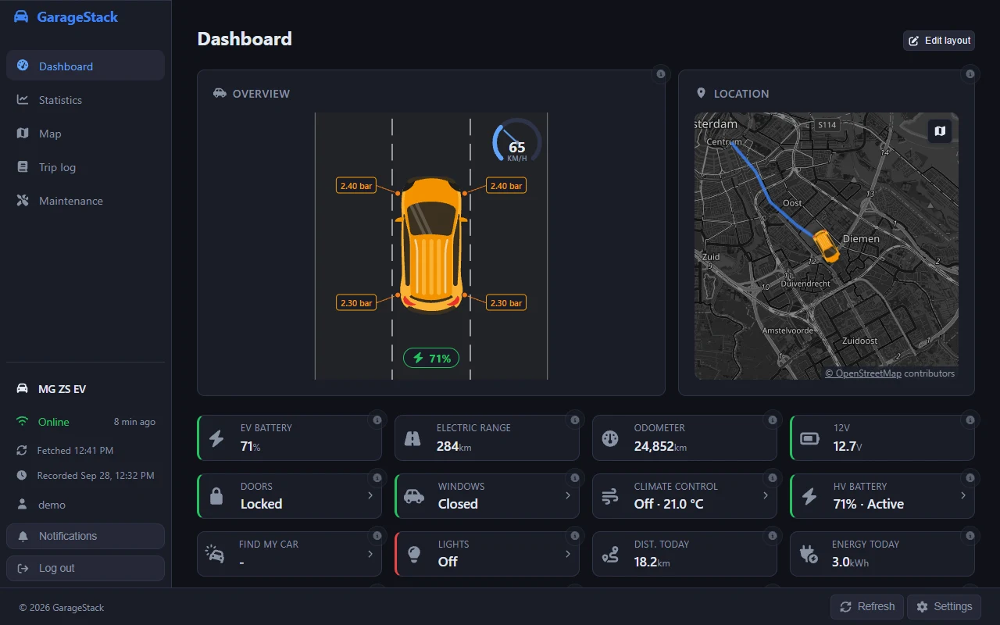

### Map

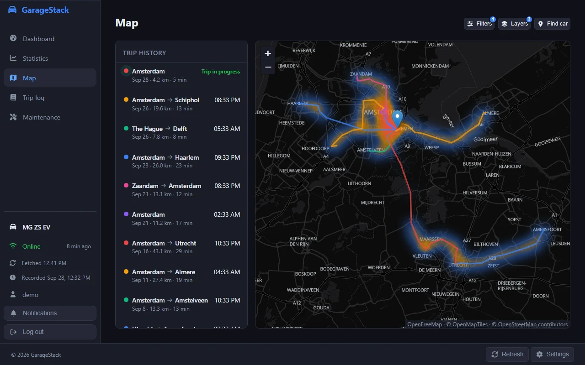

### A single trip

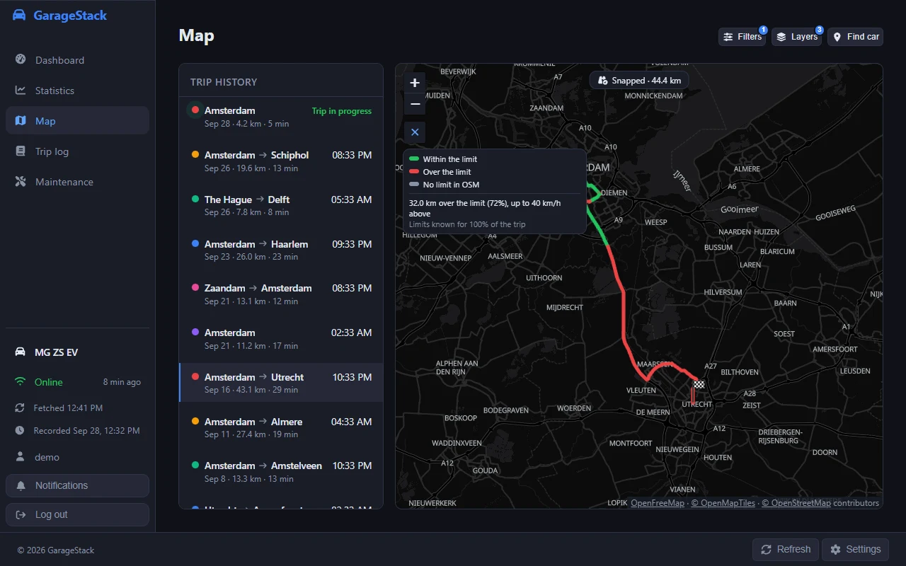

### Statistics

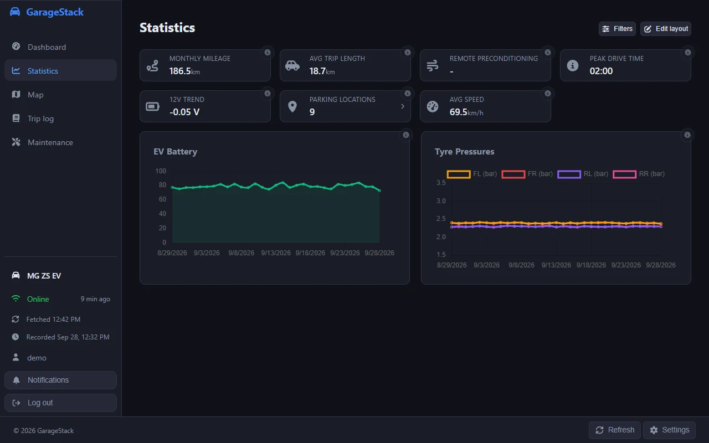

### Trip log

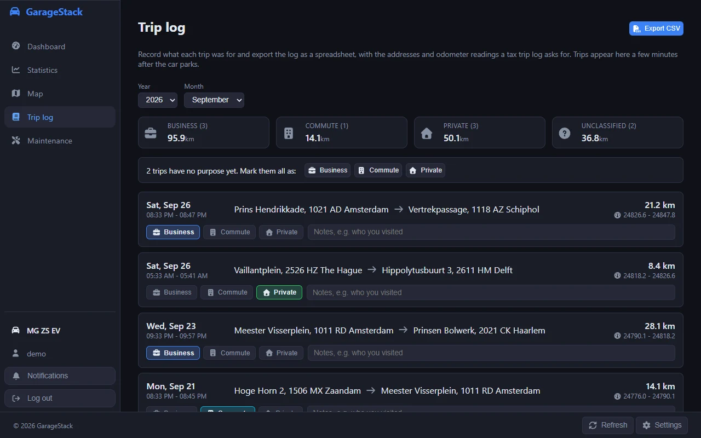

### Maintenance

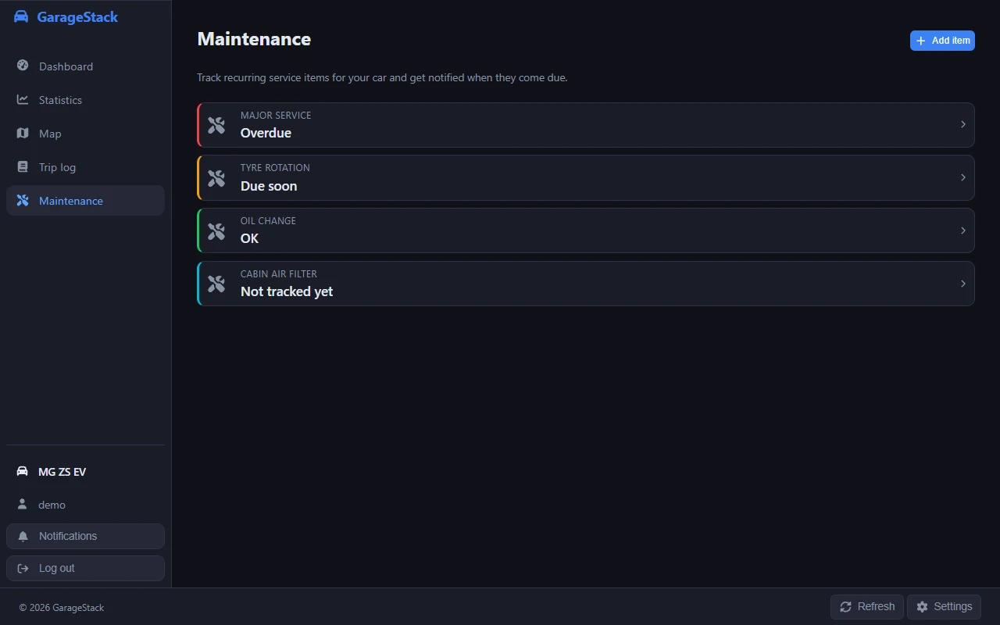

### Light theme

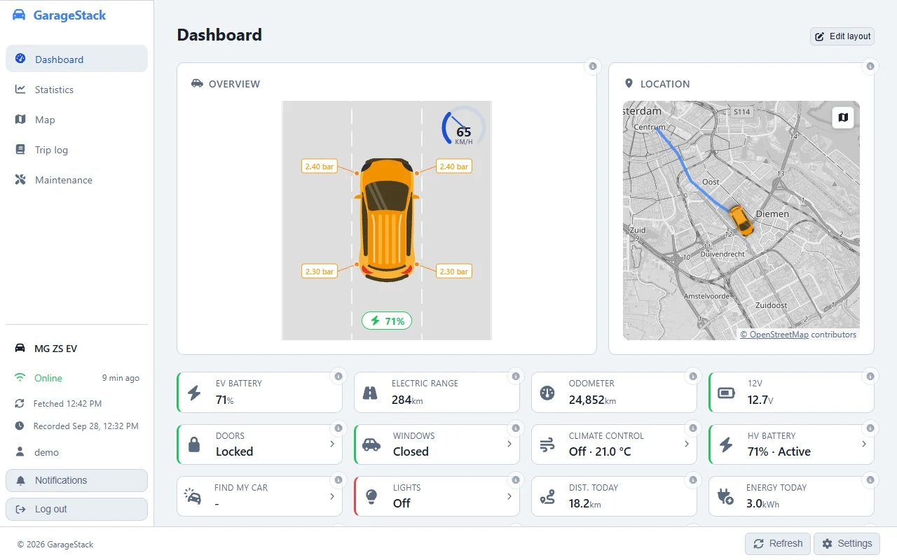

## Phone

<!-- markdownlint-disable MD033 -->

| Dashboard | Map | A single trip | Light theme |
| --------- | --- | ------------- | ----------- |
| 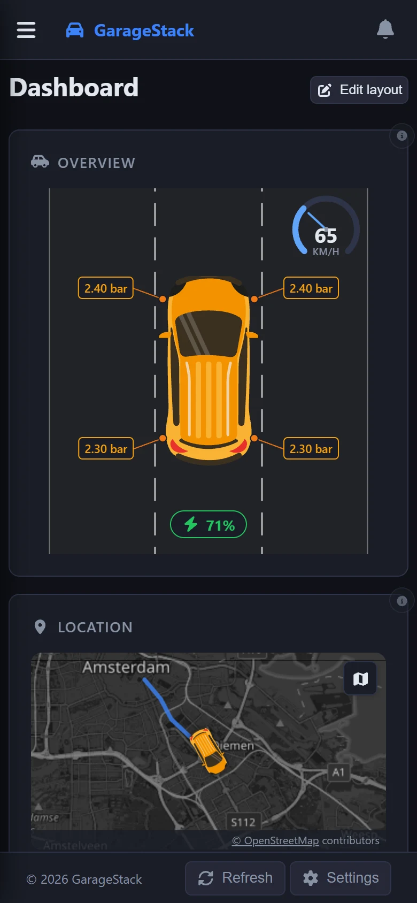 | 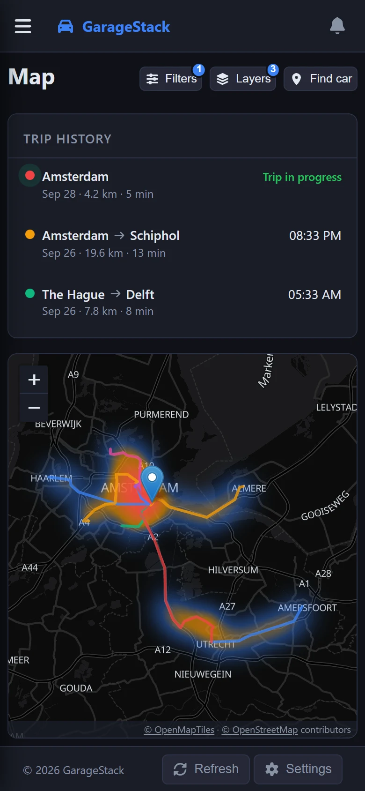 | 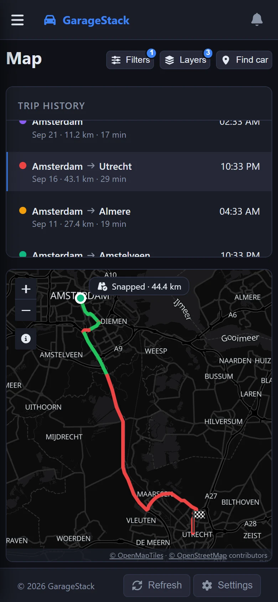 | 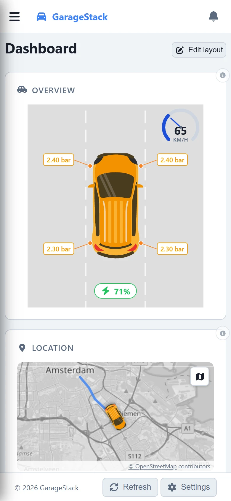 |
| **Statistics** | **Trip log** | **Maintenance** | |
| 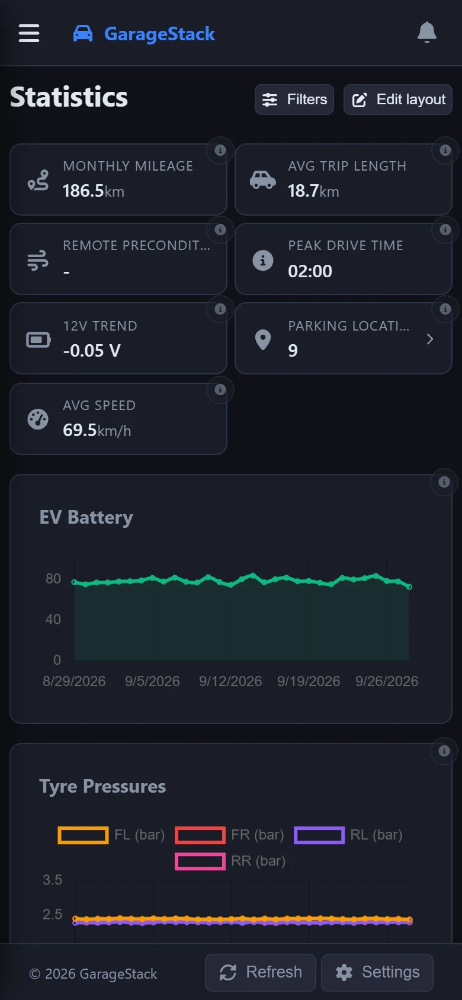 | 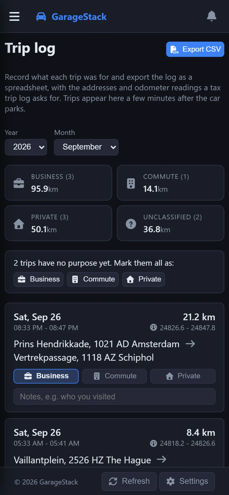 | 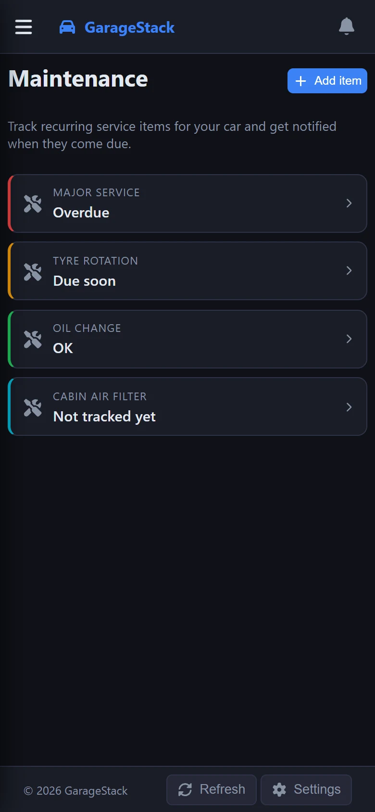 | |

<!-- markdownlint-enable MD033 -->

## Taking new ones

The desktop screenshots are 1280 x 800 and the phone screenshots 390 x 844 at twice the pixel density, in the dark theme with the date filter on 30 days. The dashboard, map and statistics screenshots are also the install screenshots in the app's manifest, as `frontend/public/screenshot-*.webp`: replace those too, and keep their `sizes` in `frontend/vite.config.ts` in step.
